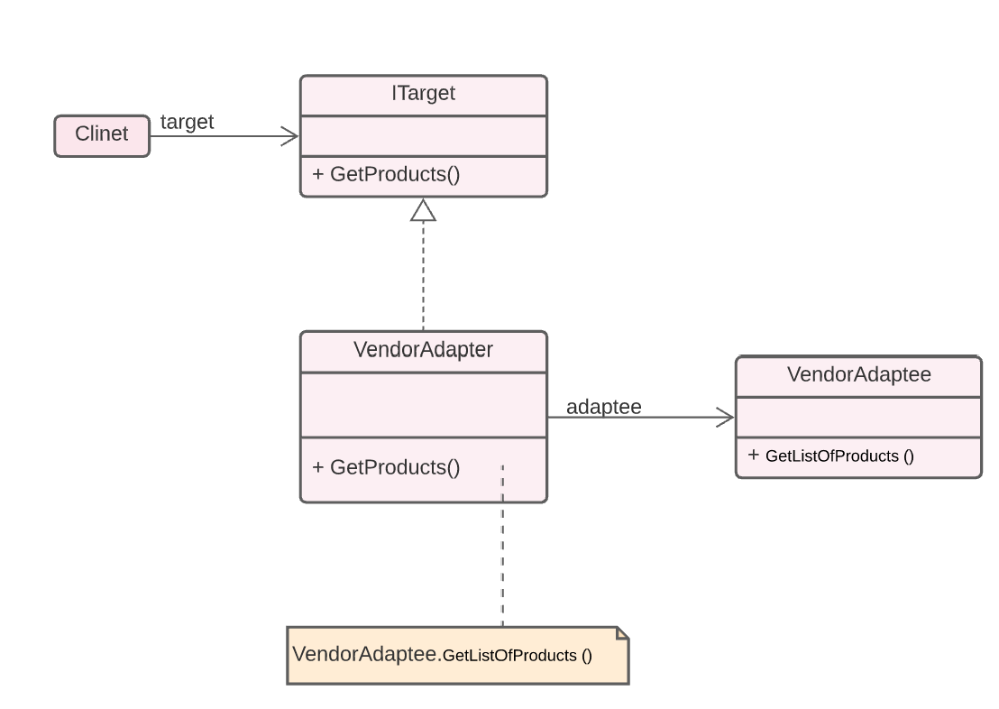
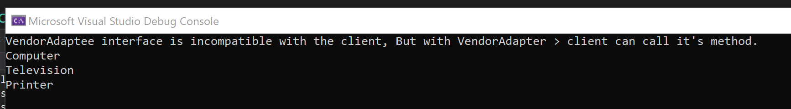

# Adapter
In general, the adapter pattern is an adequate solution for a situation when you have incompatible interfaces and none of them can be directly rewritten.

This repo contains Adapter design pattern implementation using C#

 

## UML 

## Output 

 

### By Samirah Alhusayni