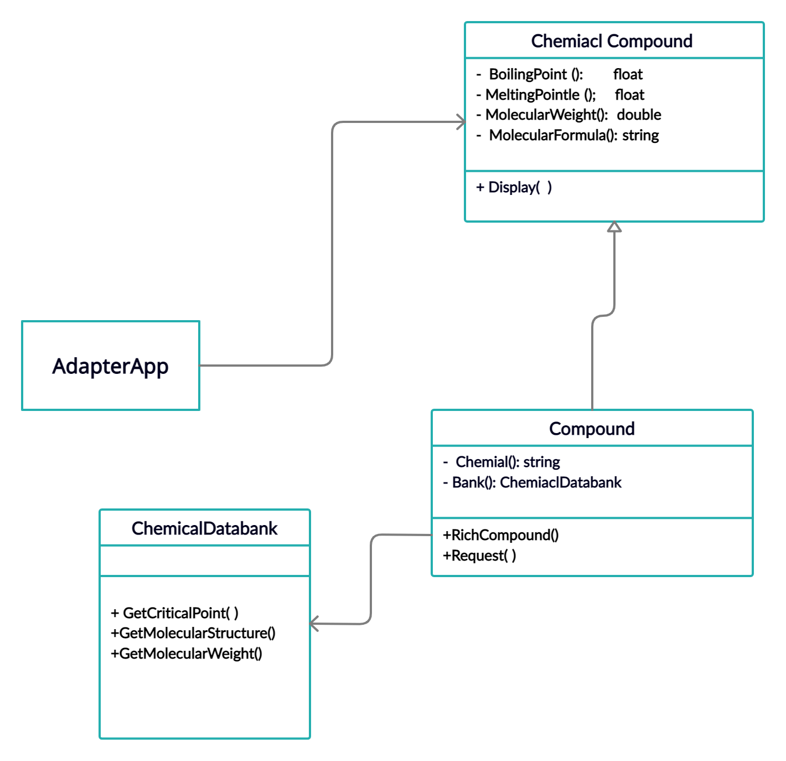

# Adapter (Chemical compound )
This Project about Convert the values ​​of chemical compounds without changing the basic value, Implemented an Adapter design pattern using C#..
### UML CLASS DAIGRAM:
