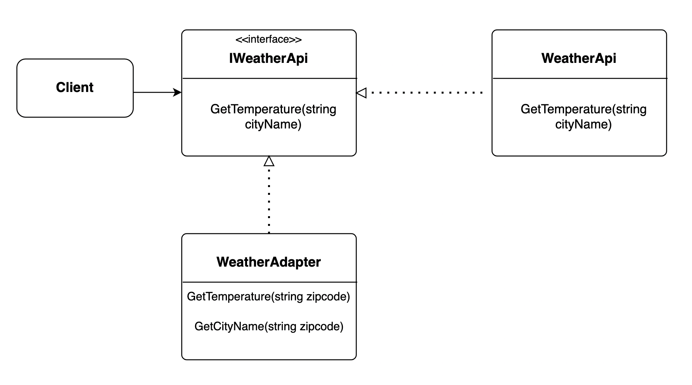

# Adapter
this repo contains Adapter design pattern implementation using C#

-----

this is an example of a Weather Api that returns the temperature of the given city name, the client wants to use the api but has city zip codes instead of city names, an Adapter class is created to help the client use the weather api.

